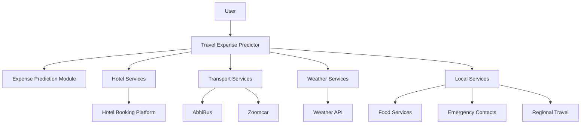
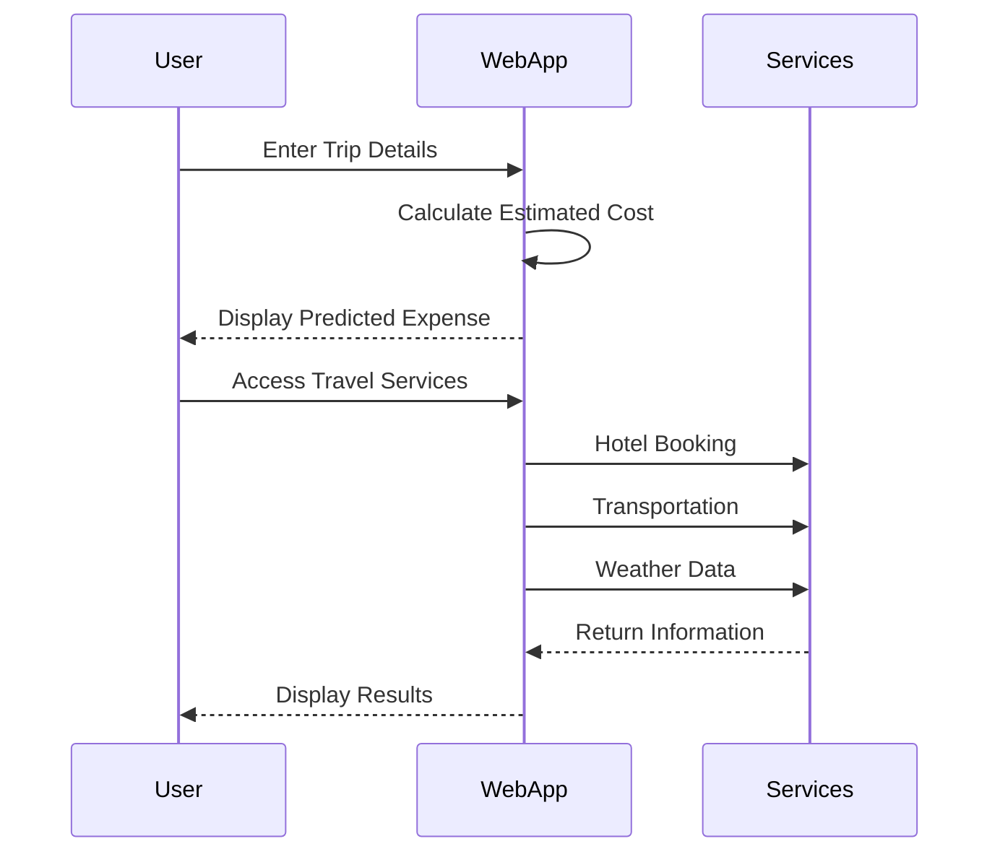

# ✈️ Travel Expense Predictor

<p align="center">
  
  
  
  
</p>

<p align="center">
  Intelligent travel planning platform that predicts trip expenses and provides integrated travel services including hotel booking, transportation, weather forecasting, and local assistance.
</p>

---

## 📌 Overview

Travel Expense Predictor is a smart web-based travel planning application designed to help travelers estimate trip costs before their journey. The system combines expense prediction with essential travel services, enabling users to make informed travel decisions and manage budgets efficiently.

The platform provides:

- 💰 Travel expense prediction
- 🏨 Hotel booking access
- 🚍 Transportation services
- 🌦️ Real-time weather information
- 🍽️ Local service recommendations
- 📱 Mobile-responsive design

---

# 🎯 Problem Statement

Travelers often face difficulties in estimating the overall cost of a trip, leading to budget overruns and poor financial planning.

This project addresses these challenges by:

- Estimating travel expenses beforehand
- Providing quick access to travel-related services
- Offering weather insights for better planning
- Simplifying transportation and accommodation booking

---

# ✨ Features

## 💵 Expense Prediction

Predicts estimated travel costs based on:

- Destination
- Number of travelers
- Travel duration
- Accommodation preferences
- Transportation expenses

---

## 🏨 Hotel Booking

Direct access to hotel reservation services.

### Benefits

- Quick hotel search
- Booking redirection
- Budget-friendly planning

---

## 🚍 Transport Services

Integrated transportation options:

- Bus Booking
- Car Rental Services

### Connected Services

- AbhiBus
- Zoomcar

---

## 🌦️ Weather Forecast

Provides weather information for selected locations.

### Advantages

- Better trip planning
- Packing assistance
- Weather-based budgeting

---

## 🍔 Local Services

Provides quick access to:

- Food Services
- Emergency Contacts
- Regional Transportation

---

## 📱 Responsive UI

Optimized for:

- Desktop
- Tablet
- Mobile Devices

---

# 🏗️ System Architecture


## 🔄 Application Workflow



## 🧠 Expense Prediction Logic

The prediction process follows:

1. User enters travel details
2. System processes trip parameters
3. Estimated expenses are calculated
4. Results are displayed instantly
5. User can explore related travel services

---

# 📂 Project Structure

```bash
Travel-Expense-Predictor/
│
├── index.html
├── style.css
├── script.js
│
├── assets/
│   ├── images/
│   └── icons/
│
├── screenshots/
│
└── README.md
```

---

# 🛠️ Technologies Used

| Technology | Purpose |
|------------|----------|
| HTML5 | Structure |
| CSS3 | Styling |
| JavaScript | Functionality |
| Responsive Design | Mobile Support |
| Weather API | Forecast Services |
| External Booking Platforms | Travel Services |

---

# 📊 Functional Modules

| Module | Description |
|---------|-------------|
| Expense Prediction | Estimates travel budget |
| Hotel Services | Accommodation support |
| Transport Services | Travel booking integration |
| Weather Forecast | Real-time weather information |
| Local Services | Food and emergency assistance |

---

# 🚀 Getting Started

## Clone Repository

```bash
git clone https://github.com/mekalakarthik05/Travel-Expense-Predictor.git
```

## Navigate

```bash
cd Travel-Expense-Predictor
```

## Run

Simply open:

```bash
index.html
```

in your browser.

---

# 📸 Screenshots

## Home Page

```md

```

## Expense Prediction

```md

```

## Travel Services

```md

```

## Mobile View

```md

```

---

# 🌟 Key Highlights

- Interactive User Interface
- Budget Planning Assistance
- Travel Service Integration
- Weather Forecasting
- Responsive Design
- Beginner-Friendly Project
- Real-World Use Case

---

# 🔮 Future Enhancements

- AI-based Expense Prediction
- Currency Conversion
- Hotel Price Comparison
- Flight Fare Prediction
- Personalized Recommendations
- Trip History Tracking
- User Authentication

---

# 📈 Potential Applications

- Tourism Platforms
- Travel Agencies
- Student Travelers
- Budget Planners
- Vacation Management Systems

---

# 👨‍💻 Author

## Karthik Mekala

- GitHub: https://github.com/mekalakarthik05

---

# ⭐ Support

If you found this project useful:

⭐ Star the repository

🍴 Fork the project

📢 Share with others

---
